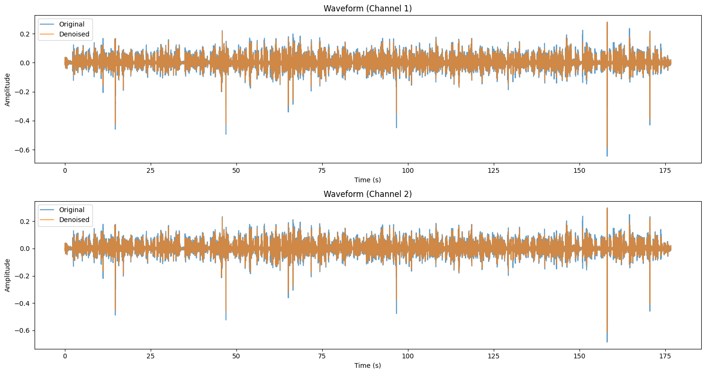
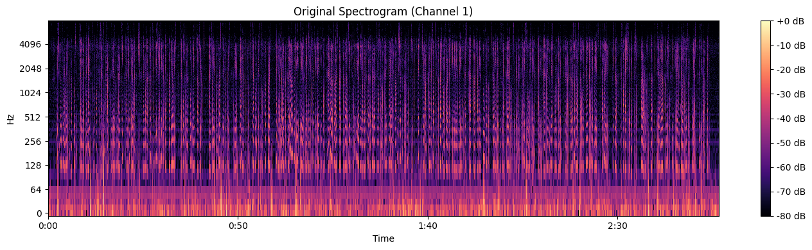
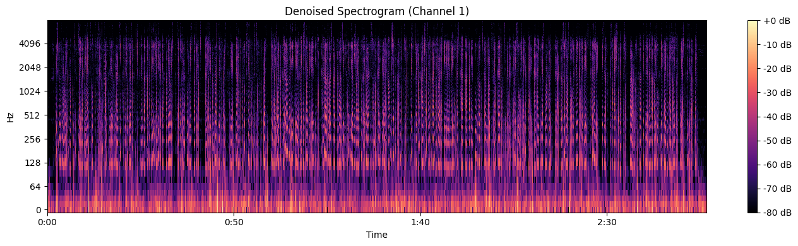

# 🎧 Audio Denoising Using DSP Techniques

A Python-based Digital Signal Processing (DSP) project for audio denoising using **Short-Time Fourier Transform (STFT)**, **Spectral Subtraction**, and **Wiener Filtering**. The project removes background noise from audio recordings and visualizes the results using waveform and spectrogram analysis.

---

## 📌 Project Overview

Background noise negatively impacts audio quality and speech intelligibility. This project implements a DSP-based audio denoising pipeline that estimates background noise and suppresses it while preserving important speech components. The system provides visual comparisons of the original and denoised signals using waveforms and spectrograms.

---

## 🎯 Objectives

- Design and implement a DSP-based audio denoising system.
- Reduce background noise from audio recordings.
- Compare original and denoised audio using waveform and spectrogram analysis.
- Improve speech clarity while preserving signal quality.

---

## ✨ Features

- 🎵 Stereo & Mono Audio Support
- 📊 Short-Time Fourier Transform (STFT)
- 🔊 Automatic Noise Spectrum Estimation
- 🎚 Spectral Subtraction
- 🎛 Wiener Filtering
- 📈 Waveform Visualization
- 🌈 Spectrogram Visualization
- 💾 Save Denoised Audio Output

---

## 🛠 Technologies Used

- Python
- NumPy
- SciPy
- Librosa
- Matplotlib
- SoundFile
- Google Colab

---

## 🧠 DSP Concepts Used

- Short-Time Fourier Transform (STFT)
- Spectral Subtraction
- Wiener Filtering
- Noise Power Spectral Density (PSD) Estimation
- Time-Frequency Masking

---

## ⚙️ Processing Pipeline

1. Load stereo or mono audio.
2. Normalize the audio signal.
3. Apply Short-Time Fourier Transform (STFT).
4. Estimate the noise spectrum.
5. Apply Spectral Subtraction or Wiener Filtering.
6. Smooth the gain mask.
7. Reconstruct the signal using inverse STFT.
8. Visualize waveform and spectrogram.
9. Save the denoised audio.

---

## 📂 Project Structure

```text
DSP-Audio-Denoiser/
│
├── DSP_Audio_Denoiser.ipynb
├── DENOISER.pdf
├── README.md
├── requirements.txt
├── 1010.mp3
└── images/
    images/
    ├── waveform_comparison.png
    ├── original_spectrogram.png
    └── denoised_spectrogram.png
```

---

## 🚀 Installation

Clone the repository:

```bash
git clone https://github.com/Taslima-Yeasmin-Oyshi/DSP-Audio-Denoiser.git
```

Install the required libraries:

```bash
pip install -r requirements.txt
```

---

## ▶️ Usage

1. Open the Jupyter Notebook or Google Colab notebook.
2. Place your input audio file in the project directory.
3. Update the input file path if necessary.
4. Run all notebook cells.
5. The denoised audio and visualizations will be generated automatically.

---

## 📷 Output Visualizations

### Waveform Comparison

Comparison of the original and denoised audio waveforms.



### Original Spectrogram

Spectrogram of the original audio signal.



### Denoised Spectrogram

Spectrogram of the audio after applying Wiener Filtering and noise reduction.



---

## 📊 Results

The implemented system successfully:

- Reduces stationary background noise.
- Produces cleaner waveforms.
- Generates clearer spectrograms.
- Improves overall speech clarity.
- Preserves important speech information.

---

## ⚠️ Challenges

- Musical noise artifacts in spectral subtraction.
- Selecting appropriate noise-only frames.
- Handling stereo audio channels independently.

### Solutions

- Frequency and temporal smoothing.
- Automatic quiet-frame detection.
- Channel-wise denoising for stereo audio.

---

## 🔮 Future Improvements

- Implement Log-MMSE based denoising.
- Add adaptive noise tracking.
- Integrate machine learning-based speech enhancement.
- Improve performance in non-stationary environments.

---

## 📄 Project Report

The complete project report is available here:

📥 **[View Project Report](DENOISER.pdf)**

---

## 📚 References

1. S. K. Mitra — *Digital Signal Processing: A Computer-Based Approach*
2. A. V. Oppenheim — *Discrete-Time Signal Processing*
3. Librosa Documentation
4. DSP StackExchange
5. Research papers on speech denoising and Wiener filtering

---

## 👥 Contributors

- Taslima Yeasmin Oyshi
- Mahir Bin Hasan
- Abdullah Al Masum

**Department of Computer Science & Engineering**  
**Varendra University**

---

## 📄 License

This project was developed for academic and educational purposes as part of the **Digital Signal Processing Lab (CSE-416)** course.

---

⭐ **If you found this project useful, please consider giving it a star!**
